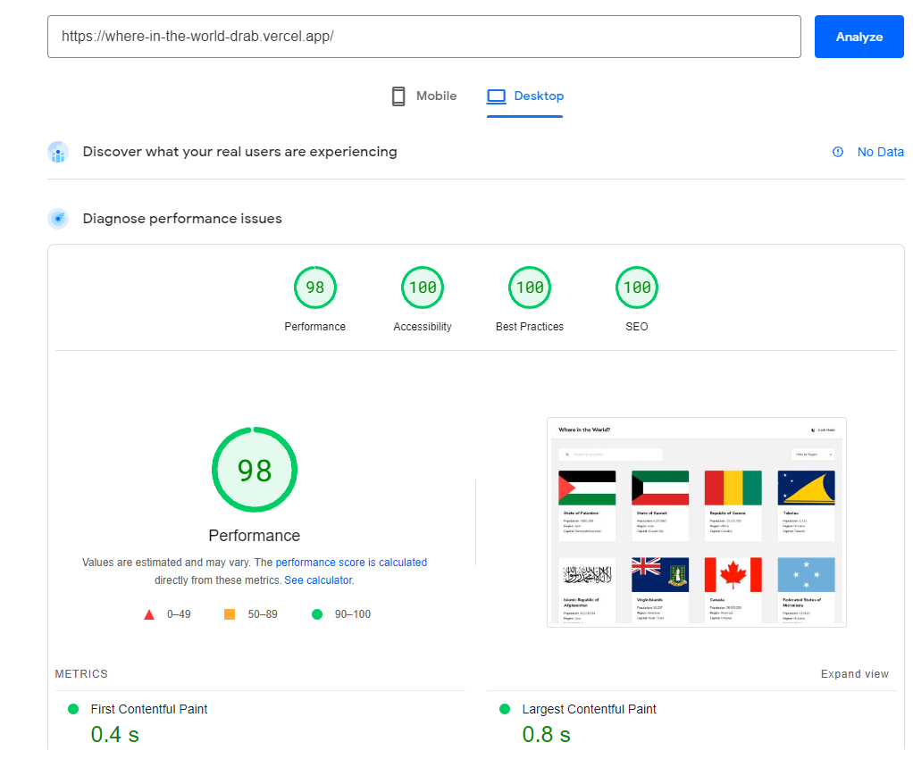

# WHERE IN THE WORLD - REST Countries API with color theme switcher

## Table of contents

- [Overview](#overview)
  - [The challenge](#the-challenge)
  - [Screenshot](#screenshot)
  - [PageSpeed Insights Report](#pagespeed-insights-report)
  - [Links](#links)
- [My process](#my-process)
  - [Built with](#built-with)
  - [What I learned](#what-i-learned)
  - [Continued development](#continued-development)
  - [Useful resources](#useful-resources)
- [Author](#author)
- [Design](#design/project)

## Overview

### The challenge

Users should be able to:

- See all countries from the API on the homepage
- Search for a country using an `input` field
- Filter countries by region
- Infinite scroll
- Click on a country to see more detailed information on a separate page
- Click through to the border countries on the detail page
- Toggle the color scheme between light and dark mode

### Screenshot

### PageSpeed Insights Report

Note:
On mobile size result in performance drop to 86, room for improvement and optimization for sure

### Links

- Live Site URL: [Live Site](https://where-in-the-world-drab.vercel.app/)

## My process

### Built with

- Semantic HTML5 markup
- CSS custom properties
- Flexbox
- CSS Grid
- Mobile-first workflow
- [Typescropt](https://www.typescriptlang.org/) - Typescript
- [Next.js](https://nextjs.org/) - React framework
- [Redux-Toolkit](https://redux-toolkit.js.org/) - redux-toolkit
- [Tailwind CSS](https://tailwindcss.com/) - For styles
- [Framer Motion](https://www.framer.com/motion/) - Smooth layout animation when filtering data

### What I learned

Learned how to implement infinite scroll for better UI/UX experience and performance.
I have improved my skills in animating elements that are added or removed in layout grid, as well as in optimizing performance. Since the API used doesn't deliver data in chunks but all at once, implementing lazy loading, suspense, and displaying initial data before the entire set is loaded becomes necessary for optimal performance.

### Continued development

Improve filter by adding population range , filter by currency etc.

### Useful resources

- [Tailwind docs](https://tailwindcss.com/docs/) - Always useful when working with tailwind.
- [Framer Motion docs](https://www.framer.com/motion/) - Great library and nice documented

## Design/Project

This is a solution to the [REST Countries API with color theme switcher challenge on Frontend Mentor](https://www.frontendmentor.io/challenges/rest-countries-api-with-color-theme-switcher-5cacc469fec04111f7b848ca). Frontend Mentor challenges help you improve your coding skills by building realistic projects.
-->

## Author

- Linkedin - [Tomislav Sertic](https://www.linkedin.com/in/tomislav-serti%C4%87-85a0941a3/)
- Frontend Mentor - [@tsertic](https://www.frontendmentor.io/profile/tsertic)
- Instagram - [@tsertic5](https://www.instagram.com/tsertic5/)
